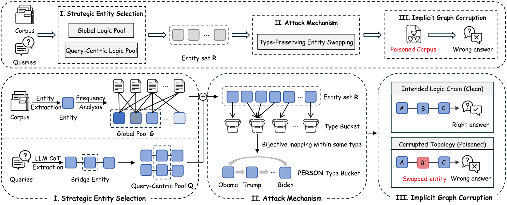

# 🧪 LogicPoison

> Official code for **"LogicPoison: Logical Attacks on Graph Retrieval-Augmented Generation"**.

<p align="center">
  <a href="https://arxiv.org/abs/2604.02954" target="_blank">
    
  </a>
  <a href="https://huggingface.co/datasets/Jord8061/datasets" target="_blank">
    
  </a>
  <a href="https://github.com/Jord8061/logicPoison" target="_blank">
    
  </a>
</p>

---
## 📢 News
- **[2026-04-04]** Our **[LogicPoison](https://github.com/Jord8061/logicPoison)** is accepted by .
- **[2026-04-03]** We release the codes of **[LogicPoison](https://github.com/Jord8061/logicPoison)** and the **[datasets](https://huggingface.co/datasets/Jord8061/datasets)**.
---

## 🔎 Overview

**LogicPoison** is a logical poisoning framework for **GraphRAG** systems.  
Instead of injecting fabricated facts or adversarial instructions into the corpus, it perturbs the **implicit reasoning topology** of the graph through **type-preserving entity swapping**.

The key idea is simple but effective:

- identify globally important logic hubs in the corpus,
- identify query-specific bridge entities required for multi-hop reasoning,
- swap entities **within the same semantic type** to keep the text locally plausible while corrupting the graph structure built from the corpus.

This causes GraphRAG systems to follow corrupted reasoning chains and produce incorrect answers, while the poisoned corpus remains surface-level natural.

<p align="center">
  
</p>

---

## 🛠️ Method

LogicPoison consists of three stages:

### 1. Global Logic Poison
Build corpus-level entity statistics and identify high-frequency entities that likely act as **global logic hubs** in the implicit graph.

### 2. Query-Centric Logic Poison
Use query-side reasoning signals to identify **bridge entities** that are important for answering multi-hop questions.

### 3. Type-Preserving Entity Swapping
Combine the selected entities and perform **bijective swapping within the same entity type** (e.g., PERSON with PERSON, ORG with ORG), producing a poisoned corpus that remains grammatically and semantically plausible at the local text level.

## 📄 Repository Structure

```text
.
├── main.py
├── README.md
├── requirements.txt
├── src/
│   ├── global_poison.py
│   ├── query_centric.py
│   └── logic_poison.py
├── img/
│   └── main_figure.png
├── eval/
│   ├── evaluator.py
│   └── evaluator_llm.py
├── datasets/
├── results/
└── ...
```

---

## 📦 Installation

### Step 1: Install Python packages

```bash
pip install -r requirements.txt
```

### Step 2 (Optional): Enable GPU with CUDA + CuPy

```bash
# check CUDA version
nvcc --version

# install ONE CuPy package matching your CUDA major version
# CUDA 11.x
pip install cupy-cuda11x
# CUDA 12.x
pip install cupy-cuda12x

# quick check
python -c "import spacy; print(spacy.prefer_gpu())"
```

### Step 3: Download spaCy language model

```bash
python -m spacy download en_core_web_trf
```

### Step 4: Download datasets

```bash
git clone https://huggingface.co/datasets/Jord8061/datasets
```

### Step 5: Set up OpenAI API

```bash
export OPENAI_API_KEY="your-api-key-here"
export OPENAI_BASE_URL="your-base-url-here"
```

## 🚀 Quick Start

Use `main.py` as the single entry point.
By default, completed stage outputs are auto-detected and skipped.
Use `--force` to rerun selected stages even if outputs already exist.

### Run all stages on all datasets

```bash
python main.py --stages all --datasets all
```

### Run selected stages on selected datasets

```bash
python main.py --stages global query --datasets hotpotqa musique
python main.py --stages logic --datasets 2wikimultihopqa
```

### Show all options

```bash
python main.py --help
```

---

## Responsible Use

This project is released for **research and defensive evaluation purposes only**.

LogicPoison demonstrates a realistic vulnerability in GraphRAG systems: even when surface text appears benign, logical structure can still be corrupted in ways that mislead graph-based retrieval and reasoning.
We release this code to support the development of more robust GraphRAG pipelines, better detection methods, and stronger defense mechanisms.

Please do **not** use this repository to attack real-world systems or deploy poisoned corpora in production environments.

---

## Citation

If you find this project useful, please cite our paper:

```bibtex
@misc{xiao2026logicpoisonlogicalattacksgraph,
      title={LogicPoison: Logical Attacks on Graph Retrieval-Augmented Generation}, 
      author={Yilin Xiao and Jin Chen and Qinggang Zhang and Yujing Zhang and Chuang Zhou and Longhao Yang and Lingfei Ren and Xin Yang and Xiao Huang},
      year={2026},
      eprint={2604.02954},
      archivePrefix={arXiv},
      primaryClass={cs.CL},
      url={https://arxiv.org/abs/2604.02954}, 
}
``` 

